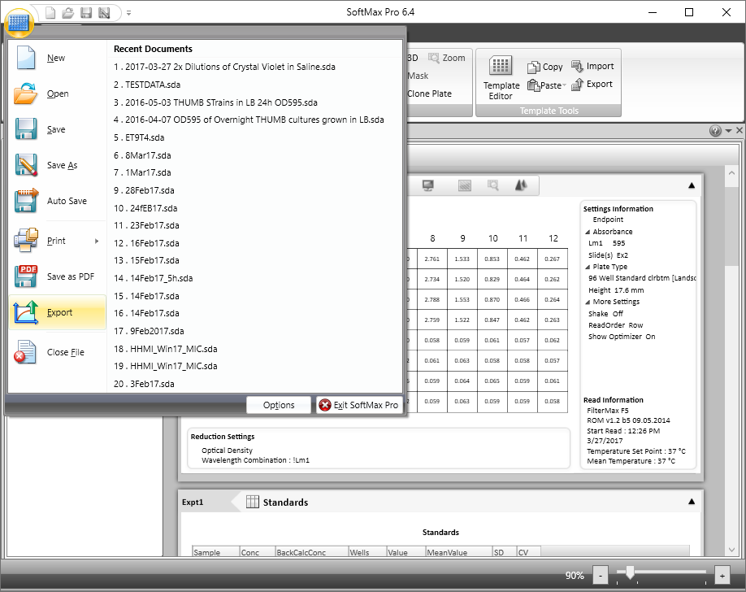
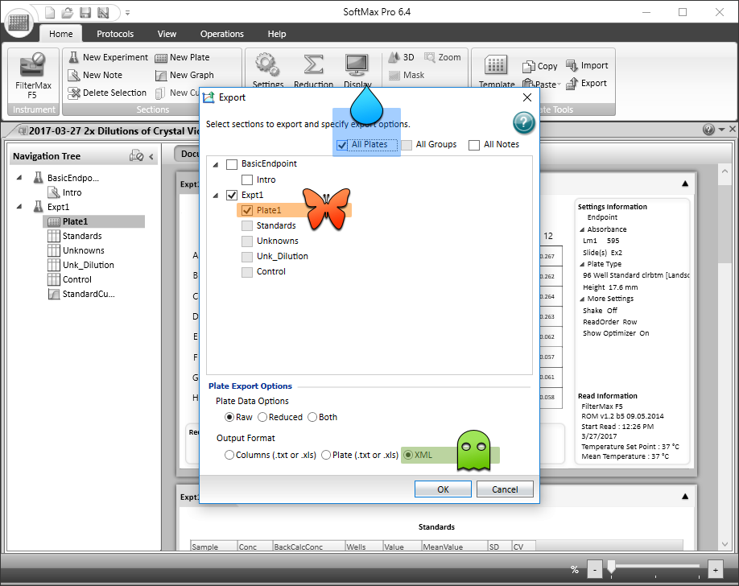

```{r, echo = FALSE}
knitr::opts_chunk$set(
  collapse = TRUE,
  comment = "#>",
  fig.path = "README-images/"
)
```

[](http://www.repostatus.org/#wip)
[](https://opensource.org/licenses/BSD-2-Clause)
[](https://cran.r-project.org/package=softermax)

Read microtiter plate data exported from [Molecular Devices](https://www.moleculardevices.com) [SoftMax Pro](https://www.moleculardevices.com/systems/microplate-readers/softmax-pro-7-software) into R.
At the moment, only XML data are supported, which requires SoftMax Pro version 5 or greater.

**Note:** Although this package is working, it's still at an early stage, so the API isn't yet stable.
Function and parameter names may change.

[Please let me know](https://github.com/briandconnelly/softermax/issues) if the package works for you or if you run into problems.


## Development Status

|                        | SoftMax 5\* | SoftMax 6 | SoftMax 7\*\* |
|------------------------|:-----------:|:---------:|:-------------:|
| Multiple Experiments   | x           | N/A\*\*\* |               |
| Multiple Plates        | x           | x         |               |
| Cuvettes               |             |           |               |
| Endpoint Reads         | x           | x         |               |
| Kinetic Reads          | x           | x         |               |
| Absorbance             | x           | x         |               |
| Fluorescence           |             |           |               |
| Luminescence           |             |           |               |
| Plate Templates        |             | x         |               |
| Notes                  |             | N/A\*\*\* |               |

\* Big thanks to [Bryon Drown](https://github.com/bdrown) for sending sample files from version 5.4!

\*\* Sample files from SoftMax Pro 7 needed

\*\*\* SoftMax Pro 6 exports all plates, etc. into one experiment. Notes cannot exported.

**Help!** I only have access to data produced by one machine and one version of SoftMax Pro (6.4), so any sample data or feedback is really apprecaited.
I do not have access to SoftMax Pro 7, so this version may not be supported.
Similarly, I do not work with cuvettes, so I could also use sample data for them.


## Installation

softermax is not quite ready to be available on [CRAN](http://cran.r-project.org), but you can use [devtools](http://cran.r-project.org/web/packages/devtools/index.html) to install the current development version:

```r
if(!require("devtools")) install.packages("devtools")
devtools::install_github("briandconnelly/softermax")
```


## Usage

To start working with your plate data in R, we'll first export the data as an XML file from SoftMax Pro.


### Exporting Plate Data as XML

With your experiment file open, select **Export** from the Main Menu.



Now, from the Export dialog, select either a single plate (orange butterfly) or all of the plates (blue raindrop) from your experiment.
Then, select **XML** under *Output Format* (green ghost), and hit the **OK** button.



Choose your file name, and you're all set.


### Importing Data into R

The `read_softmax_xml` function can read XML files exported by SoftMax Pro.
Just supply the name of the file that you saved.
For this example, I'll use one called `crystal_violet_dilutions.xml`.

```{r}
library(softermax)

cvdata <- read_softmax_xml("crystal_violet_dilutions.xml")
```

The variable `d` is an object that contains information about your experiment(s).
Most importantly, each experiment has a list of `plates` with read data.
For this example data, there is only one experiment, with one plate, which was read at one wavelength.
First, we can convert it to a data frame and look at the first ten rows:

```{r eval=FALSE}
cvdata_df <- as.data.frame(cvdata)
head(cvdata_df, n = 10)
```

```{r echo=FALSE}
cvdata_df <- as.data.frame(cvdata)
knitr::kable(head(cvdata_df, n = 10), format = "markdown")
```

Importantly, XML files created by SoftMax Pro version 6 do not differentiate among different experiments, and they do not include the experiment name, so the `Experiment` column will contain "unknown".
**This means that when multiple experiments contain plates with the same name, SoftMax Pro 6 XML files will attribute multiple plates with the same name to the same (single) experiment. When coerced to a data frame, you will not be able to differentiate among them!** Be careful.


#### Exporting the Data

At this point, you can also save the plate data to a file.
For example, we could save the first plate's data as a [csv](https://en.wikipedia.org/wiki/Comma-separated_values), which is easy to load in many other environments like Python or Excel.

```{r Export CSV}
# Option 1: Base R
write.csv(cvdata_df, file = "cv_dilutions-plate1.csv")


# Option 2: Using the readr package
readr::write_csv(cvdata_df, path = "cv_dilutions-plate1.csv")
```

You could also write the data to Google Sheets with [googlesheets](https://github.com/jennybc/googlesheets).


### Plotting the Data

Since this was a *static* (or *endpoint*) read, we can quickly make a plot of the readings for each well.
First, we can add Row and Column values for each well using functions from [microtiterr](https://github.com/briandconnelly/microtiterr).

```{r message=FALSE}
library(dplyr)
library(microtiterr)

platedata <- cvdata_df %>%
    mutate(Row = well_row(Well), Column = well_column(Well))
```

Here, we'll use [ggplot2](https://cran.r-project.org/package=ggplot2) to plot the data with `theme_bdc_microtiter` from the [ggplot2bdc](https://github.com/briandconnelly/ggplot2bdc) package to make the output look like a 96-well microtiter plate.


```{r Static Plot, cache=TRUE}
library(ggplot2)
library(ggplot2bdc)

ggplot(data = platedata, aes(x = Column, y = Row, color = Value)) +
    geom_point(data = expand.grid(Column = seq(1,12), Row = seq(1,8)),
               color = "grey90", fill = "white", shape = 21, size = 10) +
    geom_point(size = 12) +
    coord_fixed(ratio = (13/12)/(9/8), xlim = c(0.5, 12.5), ylim = c(0.6, 8.4)) +
    scale_y_reverse(breaks = seq(1, 8), labels = LETTERS[1:8]) +
    scale_x_continuous(breaks = seq(1, 12), position = "top") +
    scale_color_continuous(name = "OD595") +
    labs(title = "Crystal Violet Dilution Series (2x)", subtitle = "5 April 2017") +
    theme_bdc_microtiter()
```


## See Also

- My other packages for working with microtiter plates
    - [microtiterr](https://github.com/briandconnelly/microtiterr) - R package that provides simple functions for working with microplate data
    - [growthcurve](https://github.com/briandconnelly/growthcurve) - R package for analyzing growth (fitting growth curves)
    - [ggplot2bdc](https://github.com/briandconnelly/ggplot2bdc) - R package with simple tools for working with ggplot2. Includes `theme_bdc_microtiter` for making plots look like microtiter plates.
- [plater](https://github.com/ropenscilabs/plater) - Provides a nice interface for importing and combining data as data frames ([CRAN](https://cran.r-project.org/package=plater))


## Contributer Code of Conduct

Please note that this project is released with a [Contributor Code of Conduct](CONDUCT.md). By participating in this project you agree to abide by its terms


## Disclaimer

This project and its author are not affiliated with [Molecular Devices, LLC](https://www.moleculardevices.com).
