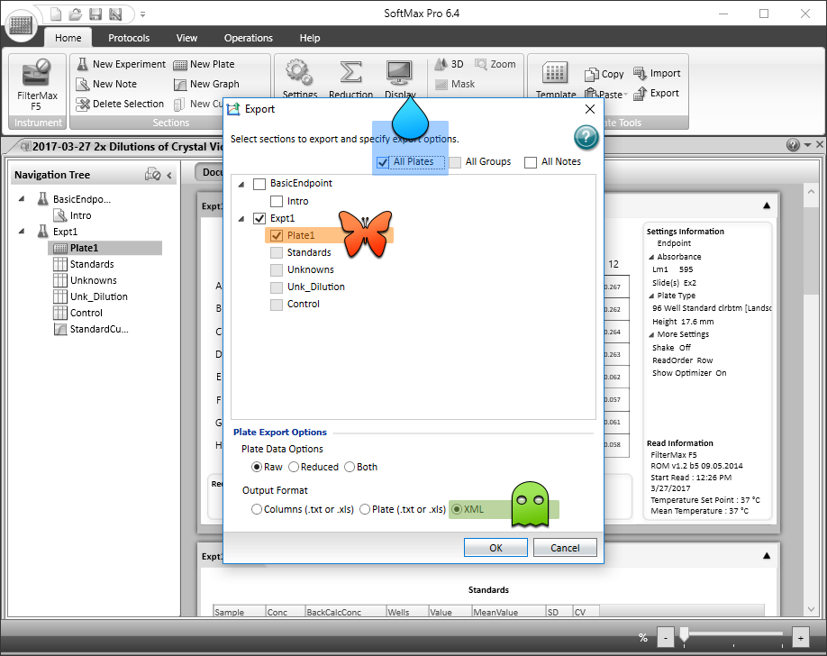

softermax
================

<!-- README.md is generated from README.Rmd. Please edit that file -->
[](http://www.repostatus.org/#wip) [](https://opensource.org/licenses/BSD-2-Clause) [](https://cran.r-project.org/package=softermax)

Read microtiter plate data exported from [Molecular Devices](https://www.moleculardevices.com) [SoftMax Pro](https://www.moleculardevices.com/systems/microplate-readers/softmax-pro-7-software).

Installation
------------

softermax is not quite ready to be available on [CRAN](http://cran.r-project.org), but you can use [devtools](http://cran.r-project.org/web/packages/devtools/index.html) to install the current development version:

``` r
    if(!require("devtools")) install.packages("devtools")
    devtools::install_github("briandconnelly/softermax")
```

Usage
-----

To start working with your plate data in R, we'll first export the data as an XML file from SoftMax Pro.

### Exporting Plate Data as XML

With your experiment file open, select **Export** from the Main Menu.


Now, from the Export dialog, select either a single plate (orange butterfly) or all of the plates (blue raindrop) from your experiment. Then, select **XML** under *Output Format* (green ghost), and hit the **OK** button.



Choose your file name, and you're all set.

### Importing Data into R

The `read_softmax_xml` function can read XML files exported by SoftMax Pro. Just supply the name of the file that you saved.

``` r
    library(softermax)

    d <- read_softmax_xml("crystal_violet_dilutions.xml")
```

The variable `d` is an object that contains information about your experiment. Most importantly, `d$plates` is a list where each element is a data frame (actually a [tibble](https://cran.r-project.org/package=tibble)) with information about each well in that plate. For this example data, there is only one plate. Let's take a look at the first ten rows:

``` r
    head(d$plates[[1]], n = 10)
```

| Plate  |  Time| Well |   Value|  Temperature|
|:-------|-----:|:-----|-------:|------------:|
| Plate1 |    NA| A1   |  4.0000|           37|
| Plate1 |    NA| A2   |  4.0000|           37|
| Plate1 |    NA| A3   |  4.0000|           37|
| Plate1 |    NA| A4   |  4.0000|           37|
| Plate1 |    NA| A5   |  4.0000|           37|
| Plate1 |    NA| A6   |  4.0000|           37|
| Plate1 |    NA| A7   |  4.0000|           37|
| Plate1 |    NA| A8   |  2.7609|           37|
| Plate1 |    NA| A9   |  1.5331|           37|
| Plate1 |    NA| A10  |  0.8534|           37|

### Plotting the Data

Since this was a *static read*, we can quickly make a plot of the readings for each well. First, we can add Row and Column values for each well using functions from [microtiterr](https://github.com/briandconnelly/microtiterr).

``` r
    library(dplyr)
    library(microtiterr)

    platedata <- d$plates[[1]] %>%
        mutate(Row = well_row(Well), Column = well_column(Well))
```

Here, we'll use [ggplot2](https://cran.r-project.org/package=ggplot2) to plot the data with `theme_bdc_microtiter` from the [ggplot2bdc](https://github.com/briandconnelly/ggplot2bdc) package to make the output look like a 96-well microtiter plate.

``` r
    library(ggplot2)
    library(ggplot2bdc)

    ggplot(data = platedata, aes(x = Column, y = Row, color = Value)) +
        geom_point(data = expand.grid(Column = seq(1,12), Row = seq(1,8)),
                   color = "grey90", fill = "white", shape = 21, size = 8) +
        geom_point(size = 9) +
        coord_fixed(ratio = (13/12)/(9/8), xlim = c(0.5, 12.5), ylim = c(0.6, 8.4)) +
        scale_y_reverse(breaks = seq(1, 8), labels = LETTERS[1:8]) +
        scale_x_continuous(breaks = seq(1, 12), position = "top") +
        scale_color_continuous(name = "OD595") +
        labs(title = "Crystal Violet Dilution Series (2x)", subtitle = "5 April 2017") +
        theme_bdc_microtiter()
```


Contributer Code of Conduct
---------------------------

Please note that this project is released with a [Contributor Code of Conduct](CONDUCT.md). By participating in this project you agree to abide by its terms

Disclaimer
----------

This project and its author are not affiliated with [Molecular Devices, LLC](https://www.moleculardevices.com).
