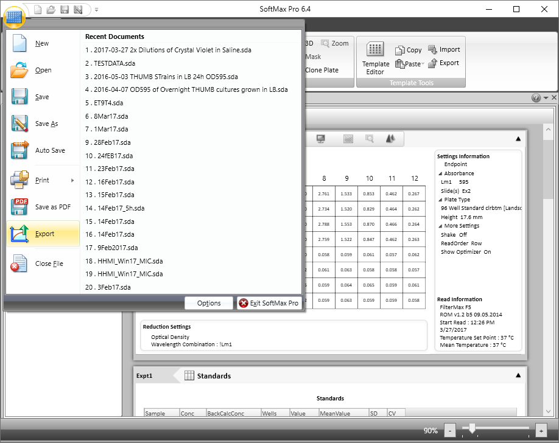

The best way to get your data from SoftMax Pro is by exporting to [XML](https://en.wikipedia.org/wiki/XML), a structured file format that softermax can understand.
XML output is supported by SoftMax Pro version 5.4 or greater.
This vignette demonstrates how to export XML data from SoftMax Pro version 6.4, however the process should be similar for other versions of SoftMax Pro.

With your experiment file open, select **Export** from the Main Menu.

Now, from the Export dialog, select either a single plate (orange butterfly) or all of the plates (blue raindrop) from your experiment.
Then, select **XML** under *Output Format* (green ghost), and hit the **OK** button.

Choose your file name, and you're all set!
You can now import your data into R using `read_softmax_xml`.
